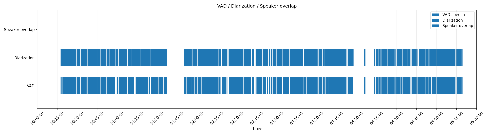

This repository explores a pipeline for turning long (french) parliamentary audio/video sessions into structured, searchable data: transcription, diarization, speaker-attributed segments, enrichment, and eventually storage/retrieval.

## Current Status

- Modular pipeline stages implemented
- Multiple full session experiments conducted
- Merge logic under active experiment (*prioritizing precision to eliminate hallucination*) 
- Pipeline validated per-stage before integration. Orchestration in progress.


# Parliamentary Audio Pipeline Notes

The project is about reconciling several imperfect signals into a higher-confidence representation of what happened in the room, then using the cleanest verified regions to improve speaker attribution over time.

- **Whisper** gives the strongest text signal, but can hallucinate, repeat text, or shift boundaries.
- **pyannote** gives the strongest speaker-activity signal, but its turns do not align cleanly with transcription segments.
- **Silero VAD** gives an independent speech-presence signal that can expose silence, gaps, and suspicious transcript regions.
- **librosa audio audits** add low-level acoustic evidence: energy, dB, zero-crossing rate, spectral centroid, bandwidth, and flatness. These help separate clean speech from silence, applause, noise, and timestamp pathologies.
- **NLP / entity extraction** helps infer speaker names and turns, but has to be treated as contextual evidence rather than ground truth. The current direction is CamemBERT rather than the earlier spaCy experiments. French parliamentary phrasing is difficult and dependency parsing alone was too brittle.
- The official parliamentary *compte rendu* is useful institutional reference material, but it is not a verbatim acoustic transcript.

The current direction is validation-driven: keep disagreement visible, mark uncertain regions, and only merge signals when there is enough evidence. 
Once a segment is sufficiently validated, it becomes useful for downstream stages: validating named speakers, confirming speaker turns against diarization, and computing cleaner voice embeddings.

## What Is Being Tested

The notes in this repository document several experiments: 

1. Whether Whisper timestamps can be used as the main merge timeline.
2. How pyannote diarization boundaries differ from Whisper transcription boundaries.
3. Whether Silero VAD is a better initial temporal anchor for "speech exists here".
4. How Whisper behaves with different VAD settings: `VAD OFF`, `VAD 1000 ms`, and `VAD 2000 ms`.
5. Which confidence proxies may help detect weak or hallucinated segments.
6. Which librosa metrics help distinguish clean speech, silence, applause, and noisy acoustic events.
7. How to flag pathological Whisper segments, such as very long timestamp spans containing only a short phrase.
8. How to detect repeated hallucinations, orphan segments, multi-speaker overlaps, and silence-gap failures.
9. How official parliamentary text differs from both acoustic speech and ASR output.
10. How NLP can help identify speaker mentions from French parliamentary phrasing.

Lesson so far: the useful signal comes from the agreement and disagreement between components.

## Current Findings

### Merge Strategy

The initial merge approach treated Whisper segment timestamps as the primary timeline and projected diarization onto them. Whisper and pyannote optimize for different tasks, so their segment boundaries drift, disagree, and sometimes encode different notions of structure.

[Journal 01: Merging Whisper and Pyannote Segments](notes/current/Journal_01_Merging.md).

### Silero VAD As Temporal Anchor

Silero VAD was added as an independent speech-presence layer. On the tested session, it detected the beginning of speech within roughly half a second of the official session start and produced more granular, human-plausible speech regions than the earlier pyannote-derived VAD approach.

[Journal 03: Silero VAD](notes/current/Journal_03_silerao-vad.md).

### Whisper VAD Experiments

[Journal 04: New Transcription Run](notes/current/Journal_04_new_run.md)  
[Journal 05: Whisper VAD Value](notes/current/Journal_05_whisper_vad_value.md)

### Audio Audit And Segment Flags

Instead of relying only on model outputs, the pipeline now also measures acoustic properties over time.
[Journal 06: Librosa Audio Audit](notes/current/Journal_06_librosa_audio_audit.md)  
[Journal 07: Heuristic Flags For Whisper Segments](notes/current/Journal_07_finding_heuristics_flags_whisper_segment.md)

### Official Transcript Comparison

The official parliamentary *compte rendu* is not a strict ground-truth transcript. It is an institutional record: edited, normalized, occasionally inconsistent, and sometimes non-verbatim.

The notes separate at least three kinds of truth:

- **acoustic truth**: what was physically spoken
- **speaker truth**: who spoke and when
- **institutional truth**: what the official record preserves

[Journal 02: Merging With New Input](notes/current/Journal_02_Merging_new_input.md)  
[Official human reference](notes/current/Assets/human_official.md)  
[Merged Whisper/human comparison artifact](notes/current/Assets/human_merged.md)

### Speaker Identification, NLP, And Voice Embeddings

The older notes explore using French NLP to identify relevant person mentions and infer turn-taking. A plain `PER` named-entity tag is not enough. The useful signal comes from the surrounding parliamentary context: formulas such as "la parole est à", "va etre posee par", speaker announcements, replies, and turn transitions.

The first version used spaCy and dependency-pattern scoring. The current direction is to use CamemBERT for stronger French language understanding, then validate inferred speakers against the temporal evidence:

- identify candidate `PER` mentions linked to speaking turns
- assign likely speakers through a forward sweep over the transcript
- run a backward validation sweep against pyannote speaker turns
- keep only high-confidence speaker-attributed regions as verified segments

Those verified segments then become training/evaluation material for voice identity. By recomputing pyannote speaker centroids from cleaner segments, the pipeline should produce more stable voice fingerprints for known parliamentary speakers. Those saved centroids can later be used to recognize the same speaker across future Assembly sessions.

See [Step 5: Identifying Speakers](notes/old/Step_5_identifying_speakers.md).

## Plots

The plots under `docs/plots` visualize signal comparisons and help explain why the pipeline now treats agreement/disagreement as data.

### Timeline Agreement

This plot compares VAD and diarization activity over time:




## Current Pipeline Direction

The intended pipeline shape is:

```text
audio/video
  -> audio extraction / normalization
  -> Silero VAD speech mask
  -> pyannote diarization
  -> Whisper transcription
  -> librosa audio audit
  -> temporal cross-check
  -> segment-level quality flags
  -> merge with uncertainty flags
  -> CamemBERT speaker/entity enrichment
  -> forward speaker sweep
  -> backward pyannote turn validation
  -> verified clean speaker segments
  -> speaker centroid / voice fingerprint refinement
  -> structured storage
  -> search / retrieval
  -> cross-session speaker matching
```

The project currently prioritizes precision and explainability over forcing a complete transcript. No absolute ground truth exists., the only possible verification is manually listening.

Missing or uncertain regions should remain visible so they can be reviewed, filtered, or reprocessed.
