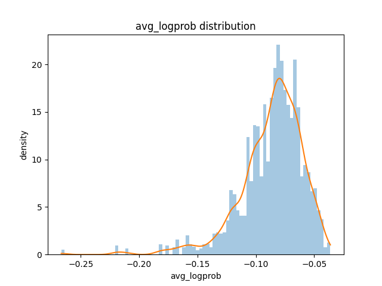

During merging,  five 10 minutes chunks were manually audited to compute the WER and CER.
No normalization needed, as the *ground truth* is subjective in this audio.

The whisper segment punctuation for ground truth was kept *as is* and the parts that were wrong were manually replace to use as ground truth.

On certain segment with bad transcription, that were unfortunately not flagged by the audit stage, the same pattern noticed before kept surfacing, log prob has a *normal* average, but there are areas of noise that sometimes produce hallucination.

While looking for a possible threshold to flag the value itself, and plotting plotting the empirical `avg_logprob` distribution with a kernel density estimate (KDE)



Computing the derivative of the KDE curve thus increasing the sudden changes, and inspecting the segments that presented such event of sudden `avg_logprob` change, revealed interesting details.

The second derivative of the KDE was also computed. 
It visually amplified curvature changes and produced oscillatory shapes, but this was exploratory only,  numerical derivatives of smoothed density estimates introduce too much noise.

```text
id=11 1074.35->1081.53 lp=-0.183 prev=-0.10066511587718048 next=-0.1825980384365406
reasons: sharp_drop delta=-0.082, large_abs_delta abs_delta=0.082
audio: flatness_local_spike z=3.44

"Borde, est remplacée jusqu'au renouvellement de l'Assemblée nationale par madame Catherine Delongue-Mingue,"
```

>The “error” is on the name. But the text is good.
>There is audio disturbance on the segment, applause and background chit chatting.

```text
id=24 1136.82->1138.12 lp=-0.219 prev=-0.10634469552473588 next=-0.21891801587996945
reasons: sharp_drop delta=-0.113, large_abs_delta abs_delta=0.113

"lésions, troubles de la coordination."
```
> *lésions* is an hallucination.

```text
================================================================================
id=33 1165.7->1168.88 lp=-0.112 prev=-0.21891801587996945 next=-0.11230469117872417
reasons: large_abs_delta abs_delta=0.107

face à une banalisation inquiétante, nous ne pouvons plus attendre.
```
> “False” positive. The person is hesitating when speaking.
>But this is the “end” of a hallucination that started on id 24. Whisper caught back to the audio *truth* 

```text
id=118 1487.2->1490.1 lp=-0.177 prev=-0.07718306589633861 next=-0.17717803536039411
reasons: sharp_drop delta=-0.100, large_abs_delta abs_delta=0.100
audio: flatness_local_spike z=2.80, flatness_delta_spike delta=0.173
flatness mean=0.06089772540895689 max=0.19615307450294495 std=0.0483912683402601 delta_max=0.1726976167410612 voiced_frames=31

La question de ces filières essentielles est donc simple.
```
> This segment and the next one are mixed up. Hesitation on the audio

There are 15 segments where there is a *`avg_logprob`* spike, either increasing or decreasing abruptly. 

The 15 segments are all either noisy - clapping, background screaming, microphone noise -, or speaker disfluency - hesitation, using *heuu* often between words, repetition.

They reveal some details:
1. audio disturbance, text correct
2. hesitation/disfluency, text correct-ish
3. hesitation/disfluency, hallucination
4. previous segment hallucination, current segment recovery
5. boundary/final segment artifact

The idea is that local `avg_logprob` discontinuities capture abrupt changes in decoder confidence, potentially revealing regions of acoustic disturbance, speaker disfluency, hallucination, or decoder recovery.

---

The next experiment, was trying to cross spectral flatness rolling mean, and calculating the local z-score on the derivative to see "peaks", and look at the 15 segments to see if some relationship was emerging between the two orthogonal signals.

Unfortunately it is unreliable.
Either the padding of the number of frame for a segment was not enough ( the audit is on 0.2 s frames ) or the hypothesis is simply not possible, using solely the flatness.

This might be worth to go back to once the pipeline runs from end to end, to detect more *probable disturbance* are.

Especially if it was possible to seperate log_prob event betwwen noisy background segments, and hallucination segment because of the speaker disfluency.

Nevertheless, a new flag `LOGPROB_DISCONTINUITY`will flag the segments themselves and theirs immediate neighbors. 

As usual not to discard it, but to keep in mind that it is more suspicious.
