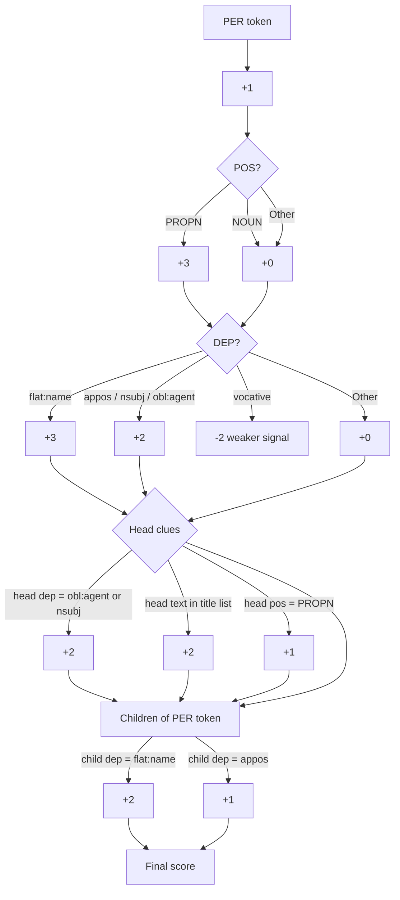

> using `fr_core_news_sm`

# Overview
The goal is to infer the current, previous, or next speaker from spaCy output.

This breaks into two sub-problems:
	1.	Identify segments containing PER entities that are structurally relevant by following the parse tree.
	2.	Determine whether the person has spoken, is speaking, or will speak, using the governing verb and its tense / construction.

I had only lightly used spaCy with English text before. 
French parliamentary text is noticeably harder:
- many sentences are passive
- speaker mentions can appear before or after the speech act
- titles and formal address introduce noise
- some PER predictions are false positives

The first objective is not to *find speakers* directly, but to identify credible person mentions inside each segment.

A PER tag alone is not enough...
The token must also participate in a dependency pattern linked to a verb lemma that suggests speech, announcement, or turn-taking.

---
# 1. Identify segments with relevant *PER*
### Example

##### TEXT
`La première va être posée par monsieur Paul Christophe, président du groupe Horizon.`

**ENTITIES**

| TEXT            | LABEL |
| --------------- | ----- |
| Paul Christophe | PER   |
**TOKENS**

| IDX | TEXT       | LEMMA      | POS   | DEP       | HEAD      | ENT_TYPE | MORPH        |             |             |               |              |
| --- | ---------- | ---------- | ----- | --------- | --------- | -------- | ------------ | ----------- | ----------- | ------------- | ------------ |
| 0   | La         | le         | DET   | det       | première  |          | Definite=Def | Gender=Fem  | Number=Sing | PronType=Art  |              |
| 1   | première   | première   | NOUN  | nsubj     | va        |          | Gender=Fem   | Number=Sing |             |               |              |
| 2   | va         | aller      | VERB  | ROOT      | va        |          | Mood=Ind     | Number=Sing | Person=3    | Tense=Pres    | VerbForm=Fin |
| 3   | être       | être       | AUX   | aux:pass  | posée     |          | VerbForm=Inf |             |             |               |              |
| 4   | posée      | poser      | VERB  | xcomp     | va        |          | Gender=Fem   | Number=Sing | Tense=Past  | VerbForm=Part | Voice=Pass   |
| 5   | par        | par        | ADP   | case      | monsieur  |          |              |             |             |               |              |
| 6   | monsieur   | Monsieur   | NOUN  | obl:agent | posée     |          | Gender=Masc  | Number=Sing |             |               |              |
| 7   | Paul       | Paul       | PROPN | appos     | monsieur  | PER      | Gender=Masc  | Number=Sing |             |               |              |
| 8   | Christophe | Christophe | PROPN | flat:name | Paul      | PER      |              |             |             |               |              |
| 9   | ,          | ,          | PUNCT | punct     | Paul      |          |              |             |             |               |              |
| 10  | président  | président  | NOUN  | appos     | Paul      |          | Gender=Masc  | Number=Sing |             |               |              |
| 11  | du         | de         | ADP   | case      | groupe    |          | Definite=Def | Gender=Masc | Number=Sing | PronType=Art  |              |
| 12  | groupe     | groupe     | NOUN  | nmod      | président |          | Gender=Masc  | Number=Sing |             |               |              |
| 13  | Horizon    | Horizon    | PROPN | nmod      | groupe    |          |              |             |             |               |              |
| 14  | .          | .          | PUNCT | punct     | va        |          |              |             |             |               |              |

> Looking for dependency patterns that express a passive announcement of the next high-confidence candidate for a speaker mention.

> The core issue is filtering a signal with uneven value density: PER is useful, but many candidate mentions are weak, noisy, or irrelevant.


```json

=== SEGMENT seg_000001 ===
IMPORTANT VERBS: ['entendu', 'est', 'appelle', 'être', 'posée']
TOKEN='Cordier' NAME='Cordier' POS=PROPN DEP=nmod HEAD='monsieur' SCORE=6
  REASONS: ent_type=PER, pos=PROPN, head.title=monsieur
  CHILDREN: []
TOKEN='Paul' NAME='Paul Christophe' POS=PROPN DEP=appos HEAD='monsieur' SCORE=13
  REASONS: ent_type=PER, pos=PROPN, dep=appos, head.dep=obl:agent, head.title=monsieur, has flat:name child, has appos child, name extended with flat:name
  CHILDREN: ['Christophe', ',', 'président']
TOKEN='Christophe' NAME='Paul Christophe' POS=PROPN DEP=flat:name HEAD='Paul' SCORE=8
  REASONS: ent_type=PER, pos=PROPN, dep=flat:name, head.pos=PROPN, name rebuilt from head PROPN
  CHILDREN: []
```
> The first segment is a success, but this was the actual example to build the logic. 
> The algorithm was almost wrote to *catch* this specific one. 

```json  
-------------------------------
=== SEGMENT seg_000002 ===
TOKEN='Merci' NAME='Merci' POS=NOUN DEP=vocative HEAD='adresse' SCORE=-1
  REASONS: ent_type=PER, pos=NOUN, dep=vocative (weaker)
  CHILDREN: ['madame']
```
> The false PER prediction on _Merci_ is successfully down-ranked.

```JSON
Text: "La parole est à présent à monsieur Jonathan Géry"
-------------------------------
=== SEGMENT seg_000234 ===
IMPORTANT VERBS: ['est']
TOKEN='Jonathan' NAME='Jonathan Géry' POS=PROPN DEP=punct HEAD='présent' SCORE=6
  REASONS: ent_type=PER, pos=PROPN, has flat:name child, name extended with flat:name
  CHILDREN: ['Géry']
TOKEN='Géry' NAME='Jonathan Géry' POS=PROPN DEP=flat:name HEAD='Jonathan' SCORE=8
  REASONS: ent_type=PER, pos=PROPN, dep=flat:name, head.pos=PROPN, name rebuilt from head PROPN
  CHILDREN: []
```
> This example is useful because it partially validates the scoring logic on a different structure, even though the parse is less intuitive than the earlier passive example.

--- 
### Code and logic

#### Loop over segments

For each segment, only continue analysis if the segment contains at least one named entity with label == "PER".
Then inspect the token list, where individual tokens may also carry ent_type == "PER".

For each token in the segment, look if there are verbs with a specific **lemma** : adresser, appeler, annoncer... .
> Surely this should be a second filter, but not yet in the current code. 

Now calculate the score for each PER

### Score for each **PER**

Get their `dep`, `pos`, and `head_token` 

1. Because it is a PER, add  1 to the score

2. If the PER is a PROPN, add 3 to the score
	.  0 if it is a NOUN

3. Look for the dependency hint. 
	. **flat:name** + 3
	. **appos** (renames or identifies a noun next to it), **nsubj** (nominal subject), **obl:agent** (doer of an action in a passive construction) + 2
	 . **vocative** ( often address someone rather than identify the current/next speaker, they can also be noisy under NER, as with Merci ) - 2

4. Head clues, look at the head `dep`and `pos`
	. **obl:agent** or **nsubj** + 2
	. if in a *hardcoded* list of word ( *e.g.* :  monsieur, madame, m. , mme... ) + 2
	. **PROPN** + 1

5. retrieve all children = tokens whose head_i points to the current **PER token** (This returns only **direct children**, not the full subtree )
	. if there are  **flat:name** +2 
	. **appos** + 1



```text
posée (VERB)
└── monsieur (obl:agent)
    └── Paul (appos, PER)
        ├── Christophe (flat:name, PER)
        └── président (appos)
```
> The scoring system is designed to reward PER tokens that sit inside this kind of name-bearing structure.

---
### **Current limitation**

At this stage, the score only estimates whether a PER token is a good **person candidate**.

It does **not yet fully determine** whether this person is the previous speaker, current speaker, or next speaker.


---

> Use transcript segments to extract evidence, but perform speaker attribution on collapsed diarization turns
